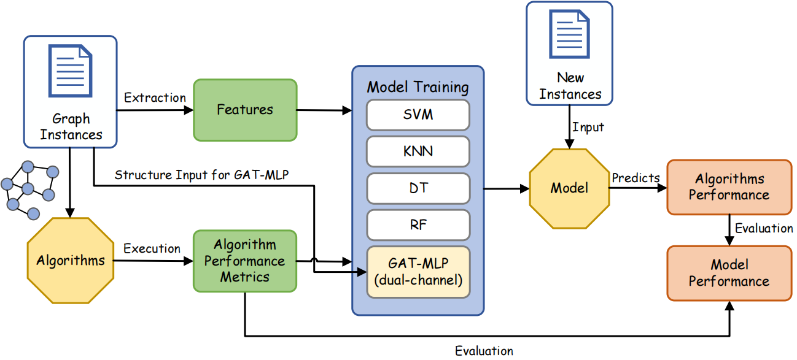
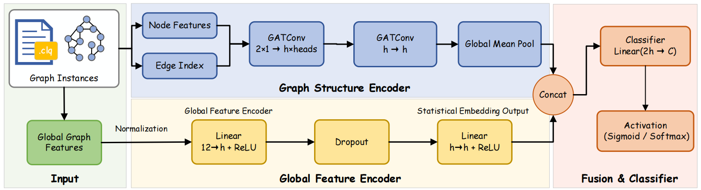

# GAT-MLP: An Algorithm Selection Model for Maximum Clique

GAT-MLP is a learning-based **algorithm selection model** for the **Maximum Clique Problem (MCP)**.  
Given a graph instance, GAT-MLP automatically recommends the most suitable one among **four exact MCP algorithms**, aiming to improve overall solving efficiency and robustness across diverse graphs.

---

## Contribution

  

  <em>Figure 1. The proposed algorithm selection framework</em>

### 1) Algorithm Selection Framework
We propose a data-driven algorithm selection framework with the following pipeline:

- **Collect graph instances** and run each of the four exact algorithms on them  
- Record **algorithm performance**  
- Extract **graph structural features** and **global features** from each instance  
- Combine “graph features + algorithm performance” to train the selection model  
- Use the trained model to **select the best algorithm for unseen graphs**

---

### 2) The GAT-MLP Model

  

  <em>Figure 2. Architecture of the GAT-MLP model</em>

**The GAT-MLP model combines the Graph Attention Network (GAT) for local structure encoding and the Multi-Layer Perceptron (MLP) for global feature modeling. It is specifically designed for algorithm selection in solving the Maximum Clique Problem (MCP).**

- **GAT** encodes local structural information and captures important neighborhood interactions.  
- **MLP** models global features and fuses graph-level statistics with structural signals.  

---

## Results
Comprehensive experimental results and comparisons are provided in the result/ folder, including the performance of the effectiveness of GAT-MLP in selecting the best solver.

More materials and information will be provided after the paper is accepted.
